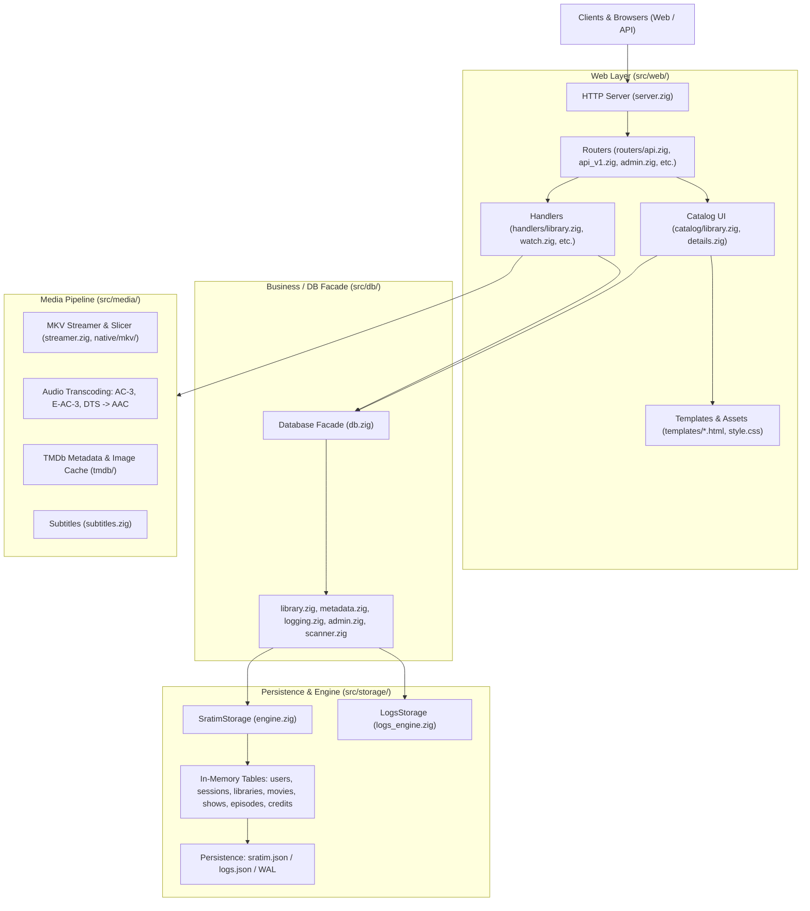

# Sratim Architecture Documentation

Sratim is a self-hosted, high-performance, pure Zig media server built for **Zig 0.17.0**. It has zero C/libc dependencies, features in-memory embedded tables with write-ahead logging (WAL) and snapshot persistence, native MKV streaming with pure Zig audio transcoding (AC-3, E-AC-3, DTS, AAC), and a responsive web interface.

---

## 1. System Overview

---

## 2. Directory & Module Breakdown

### `src/main.zig`
- Application entry point.
- Parses command-line flags and environment.
- Initializes configuration ([`src/config.zig`](file:///Users/borisk/Programming/Zig/sratim/src/config.zig)), storage engine ([`src/storage/engine.zig`](file:///Users/borisk/Programming/Zig/sratim/src/storage/engine.zig)), and logs engine ([`src/storage/logs_engine.zig`](file:///Users/borisk/Programming/Zig/sratim/src/storage/logs_engine.zig)).
- Starts the HTTP server loop and coordinates graceful shutdown.

### `src/storage/` — Embedded Database Engine
All database state is stored in memory using `zembed.Table` and persisted via JSON snapshots and write-ahead logs (WAL). No external database server (SQLite, PostgreSQL, etc.) is used.

- **[`src/storage/engine.zig`](file:///Users/borisk/Programming/Zig/sratim/src/storage/engine.zig)** (`SratimStorage`):
  - Primary catalog storage coordinator protected by a read-write lock (`rwlock: std.Io.RwLock`).
  - Tables:
    - `users`: `Table(User)` (keyed by `username`)
    - `sessions`: `Table(Session)` (keyed by `token`)
    - `libraries`: `Table(Library)` (keyed by `id`, auto-increment)
    - `movies`: `Table(Movie)` (keyed by `id`, auto-increment)
    - `shows`: `Table(Show)` (keyed by `id`, auto-increment)
    - `episodes`: `Table(Episode)` (keyed by `id`, auto-increment)
    - `people`: `Table(Person)` (keyed by TMDb `id`)
    - `movie_credits`: `Table(MovieCredit)` (keyed by `id`, auto-increment)
    - `show_credits`: `Table(ShowCredit)` (keyed by `id`, auto-increment)
- **[`src/storage/schema.zig`](file:///Users/borisk/Programming/Zig/sratim/src/storage/schema.zig)**:
  - Strong struct definitions and memory management:
    - [`Library`](file:///Users/borisk/Programming/Zig/sratim/src/storage/schema.zig#L45): ID, name, path, `LibraryType` (`.Movies`, `.Shows`, `.Other`), scan intervals.
    - [`Movie`](file:///Users/borisk/Programming/Zig/sratim/src/storage/schema.zig#L65): ID, `library_id`, file path, clean name, title, TMDb ID, poster/backdrop, release date.
    - [`Show`](file:///Users/borisk/Programming/Zig/sratim/src/storage/schema.zig#L109): ID, `library_id`, directory path, title, TMDb ID, overview, poster/backdrop.
    - [`Episode`](file:///Users/borisk/Programming/Zig/sratim/src/storage/schema.zig#L145): ID, `show_id`, file path, season, episode, title, overview, file size.
    - [`Person`](file:///Users/borisk/Programming/Zig/sratim/src/storage/schema.zig#L347): TMDb Person ID, name, profile image path, department.
    - [`MovieCredit`](file:///Users/borisk/Programming/Zig/sratim/src/storage/schema.zig#L402) / [`ShowCredit`](file:///Users/borisk/Programming/Zig/sratim/src/storage/schema.zig#L438): Links movies/shows to people, storing character name or crew job.
    - [`User`](file:///Users/borisk/Programming/Zig/sratim/src/storage/schema.zig#L182) & [`Session`](file:///Users/borisk/Programming/Zig/sratim/src/storage/schema.zig#L206): Auth accounts, password hash/salt, admin flag, session tokens.
- **[`src/storage/snapshot.zig`](file:///Users/borisk/Programming/Zig/sratim/src/storage/snapshot.zig)**:
  - Serialization and deserialization of `sratim.json`.
- **[`src/storage/logs_engine.zig`](file:///Users/borisk/Programming/Zig/sratim/src/storage/logs_engine.zig)** & **[`src/storage/logs_wal.zig`](file:///Users/borisk/Programming/Zig/sratim/src/storage/logs_wal.zig)**:
  - Tracks playback progress, playback logs, and login telemetry (`logs.json`, `logs.wal`).
- **[`src/storage/media/`](file:///Users/borisk/Programming/Zig/sratim/src/storage/media/)**:
  - `library.zig`: Library CRUD, including cascading cleanup of associated movies/shows/episodes/credits.
  - `movies.zig`: Movie querying, metadata unlinking, missing metadata search.
  - `shows.zig`: TV show and episode querying and linking.
- **[`src/storage/sort.zig`](file:///Users/borisk/Programming/Zig/sratim/src/storage/sort.zig)**:
  - Natural sorting that ignores leading articles (`"A "`, `"An "`, `"The "`) so titles sort alphabetically by their core names.

### `src/db/` — Business Layer Facade
The `src/db/` module exposes ergonomic, thread-safe functions that abstract `SratimStorage` and `LogsStorage` for web handlers:
- **[`src/db/db.zig`](file:///Users/borisk/Programming/Zig/sratim/src/db/db.zig)**: Struct `Database` holding pointers to `catalog: ?*SratimStorage` and `logs: ?*LogsStorage`.
- **[`src/db/library.zig`](file:///Users/borisk/Programming/Zig/sratim/src/db/library.zig)**: `addLibrary`, `getLibraries`, `getLibraryById`, `renameLibrary`, `deleteLibrary`. Automatically persists snapshots.
- **[`src/db/scanner.zig`](file:///Users/borisk/Programming/Zig/sratim/src/db/scanner.zig)**: Iterates local filesystem directories to ingest media into catalog tables.
- **[`src/db/admin.zig`](file:///Users/borisk/Programming/Zig/sratim/src/db/admin.zig)**: Calculates aggregate counts (movies, shows, episodes, actors, directors, storage bytes).
- **[`src/db/logging.zig`](file:///Users/borisk/Programming/Zig/sratim/src/db/logging.zig)**: User playback progress and position persistence.
- **[`src/db/metadata.zig`](file:///Users/borisk/Programming/Zig/sratim/src/db/metadata.zig)**: TMDb search and manual matching.

### `src/web/` — Web & API Server
- **[`src/web/server.zig`](file:///Users/borisk/Programming/Zig/sratim/src/web/server.zig)**: Main connection listener routing HTTP requests.
- **Routers (`src/web/routers/`)**:
  - `api.zig`: Web UI API routes (`/api/library/rescan`, `/api/library/rename`, `/api/library/delete`, `/api/watch/event`, `/api/browse`, `/api/v1/admin/analytics`).
  - `api_v1.zig`: External REST API endpoints (`/api/v1/libraries`, `/api/v1/movie`, `/api/v1/show`, etc.).
  - `admin.zig`: Admin panel routes (`/admin`, `/admin/users/toggle_admin`, etc.).
  - `auth.zig`: Web session login and logout.
  - `browse.zig`: Media catalog browsing and video player HTML rendering.
  - `static.zig`: Serves CSS, favicon, and cached TMDb images.
- **Handlers (`src/web/handlers/`)**:
  - `library.zig`: Request parsing, JSON serialization, and response writing for library actions.
  - `watch.zig`: Playback event recording.
  - `admin.zig`: Admin dashboard rendering.
- **Catalog Views (`src/web/catalog/`)**:
  - `library.zig`: Generates library view pages, including admin action controls (Rescan, Rename, Delete).
  - `details.zig`: Movie and TV show detail views with cast, crew, and seasons.
  - `person.zig`: Actor/director filmography pages.
  - `cards.zig`: Reusable media card HTML generation.
- **Templates (`src/web/templates/`)**:
  - Responsive HTML templates (`admin.html`, `library_view.html`, `movie_details.html`, `show_details.html`, `person_details.html`, `login.html`, `dashboard.html`).
  - Web player frontend (`player.html`, `player.js`, `player.css`, `stats.js`, `stats.css`): In-browser MSE video streaming engine, subtitle/audio track managers, Chromecast integration, and resilient back navigation supporting fullscreen exits and auto-hide controls.
- **Styling (`src/web/style.css`)**:
  - Unified CSS stylesheet using modern dark UI aesthetics, glassmorphism, responsive grids, and clean action buttons.

### `src/media/` — Streaming & Native Transcoding Pipeline
- **[`src/media/native/mkv/`](file:///Users/borisk/Programming/Zig/sratim/src/media/native/mkv/)**:
  - Native Matroska (MKV) track parser and zero-copy video slicer producing fragmented MP4 (fMP4) on the fly for browser playback.
- **Audio Transcoding**:
  - Pure Zig decoders for AC-3, E-AC-3, and DTS that downmix/transcode to AAC-LC directly in memory without requiring external processes or libc dependencies.
- **[`src/media/subtitles.zig`](file:///Users/borisk/Programming/Zig/sratim/src/media/subtitles.zig)**:
  - SRT and WebVTT subtitle extraction and streaming.
- **[`src/media/tmdb/`](file:///Users/borisk/Programming/Zig/sratim/src/media/tmdb/)**:
  - The Movie Database (TMDb) HTTP client and image asset downloader/caching.

---

## 3. Core Architectural Invariants & Rules

1. **Pure Zig (No Libc / No C Dependencies)**:
   - All code compiles purely with native Zig without linking libc (`-lc`).
   - Cross-compilation targets (`x86_64-linux`, `aarch64-linux`, `x86_64-windows`, `aarch64-macos`) build cleanly without system toolchains.

2. **Strict Filesystem Safety for Media Content**:
   - **Never delete or alter media files or folders on disk during catalog operations.**
   - Deleting a library or unlinking media must strictly purge records in memory (`SratimStorage`) and update the snapshot, leaving disk files completely untouched.

3. **In-Memory Tables & Snapshot Durability**:
   - Any mutating operation on `SratimStorage` (`addLibrary`, `renameLibrary`, `deleteLibrary`, `addOrUpdateMovie`, etc.) must be committed to the snapshot (`cat.snapshot() catch {}`) to maintain durability across restarts.
   - When deleting a parent entity (e.g., a library or a TV show), cascade the deletion to its children (`movies`, `shows`, `episodes`, `credits`) and deinitialize their heap memory with `self.allocator`.

4. **Security & Role-Based Access Control**:
   - Any route modifying system state, scanning folders, or performing administrative actions must guard with `if (!session_info.is_admin) return 403 Forbidden`.
   - Admin-only UI buttons (Rescan, Rename, Delete) must only be rendered into HTML when `is_admin == true`.

5. **Sorting Standards**:
   - Movie and show sorting must ignore leading articles (`"A"`, `"An"`, `"The"`) via [`src/storage/sort.zig`](file:///Users/borisk/Programming/Zig/sratim/src/storage/sort.zig).

6. **Test Hygiene**:
   - All tests must use `tmp/` for temporary test files, snapshots, and WAL logs.
   - All temporary files and test directories must be cleanly removed in `defer` blocks.
   - Tests are run via `zig build test --summary all`.
